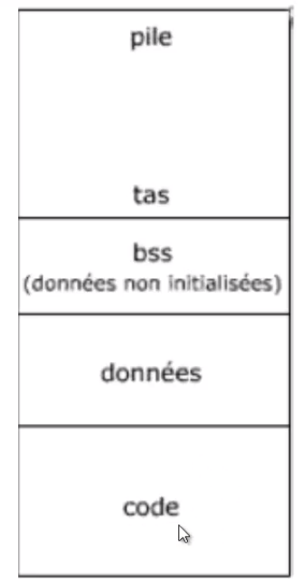
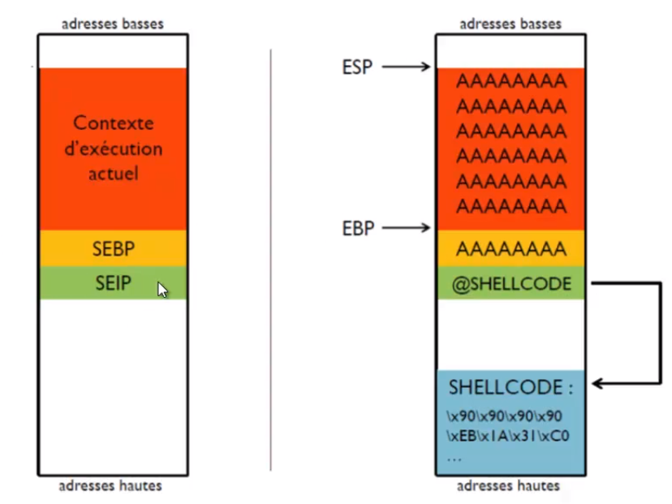

# Introduction - The Basics

Links to assembler courses:
* https://asm.developpez.com/cours/

Managing the memory of a binary:
* https://manybutfinite.com/post/anatomy-of-a-program-in-memory/

Protection mechanisms:
* https://www.corelan.be/index.php/2009/09/21/exploit-writing-tutorial-part-6-bypassing-stack-cookies-safeseh-hw-dep-and-aslr/

**Memory Segments**

* code: contains the instructions to be executed. The instructions are not linear (presence of jumps to other addresses). It is a fixed size segment, read-only. If the program is run several times, this segment will only be present once in RAM.
* data: used to store *initialized* global and static variables. The segment is of fixed size, readable and writable.
* bss: allows you to store *uninitialised* global and static variables. Fixed size segment, readable and writable.
* heap: A segment used by the programmer to allocate memory at will. Once used, these blocks must be deallocated. It varies in size as the program uses it. It has a growing size towards the bottom (high memory addresses).
* Stack: A variable size segment that contains the environment (function activation block) of each function, its parameters, its variables, the return address => the function context

# Buffer Overflow (BOF)

The flaw => copying data without checking the size. This is a bug whereby a process, when writing to a buffer, writes outside the space allocated to the buffer, thereby overwriting information needed by the process. The objective is to have instructions introduced into the process executed.

**What happens**

We go beyond the current execution context to inject into EIP the address of our Shellcode (taking control of a root access...)

TODO: integer overflow