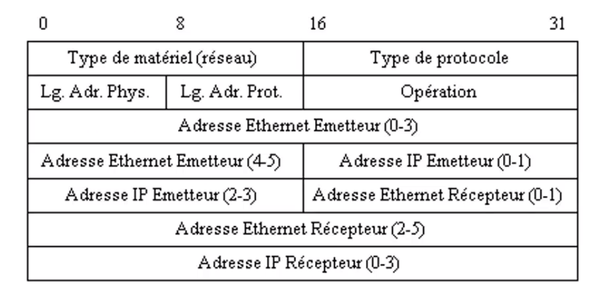
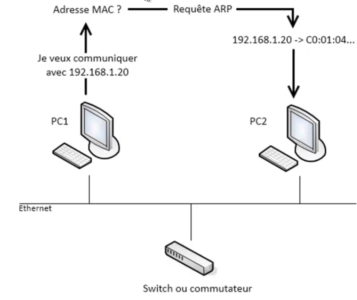

# Man in the Middle

**Concept:**
The hacker is connected to the same switch as the victims and performs a kind of relay between them.

## ARP protocol

pc1 wants to communicate with pc2 and sends an ARP request to get its MAC address. pc2 returns its MAC address.

## Tools

### DriftNet
Allows you to capture images of network traffic and display them in a window.

Coupled with a MITM, it allows you to see all the images of a given target.

### 3vilTwinAtatcker
Create a fake access point to facilitate an MITM attack.

