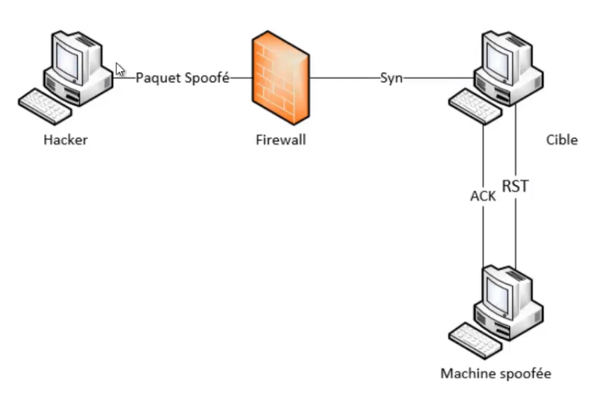

# Spoofing networks

**Concept:**
Sending IP packets using a source IP address that has not been assigned to the sending computer. This is used to:
* Hide one's own identity during a server attack.
* Impersonate other network equipment to gain access to services.
* Modify packets to gain information between two communicating parties.



The hacker sends a spoofed packet to try to take the identity of the spoofed machine. The target machine will think it is the genuine machine trying to communicate with it. Without meaning to, the target sends the packets back to the hacker.

**Example**: if a hacker manages to spoof a DNS server, he can recover its IP address and thus redirect the target to any site (phishing...)

## Tools

### DNSChef
To create fake domains (domain request) and control the victim's traffic

```sh
dnschef --fakeip=192.168.133.129 --fakedomains alphorm.com --interface 192.168.138.149 -q
```

* fakedomains: domain the user wants to reach
* fakeip: IP to which the user will be redirected
* interface: refers to the interface used

### ARPSpoof
* sniff traffic
* Forge ARP packets between 2 communicating parties
* ARP cache and MAC address

* arpspoof -t
arpspoof -t [@targetmachine] [@poofedmachine]
```

**Ettercap**
```sh
-> Sniff -> unified sniffing
-> Hosts -> Hosts list -> Hosts scan choose target machine -> add to target -> MITM -> ARP poisoning sniff remote connections/only poison one-way
-> Plugins -> manage the plugins # double click dns-spoof
/etc/ettercap/etter.dns # set desired redirects
```