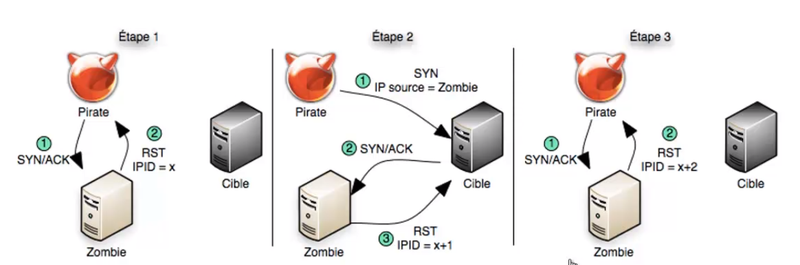

# Network vulnerabilities

## Idle Host Scanning - Zombie scanning

**Concept** : Scanning ports on a machine, but the target machine thinks it is another person scanning it => Anonymity.


When a machine receives 2 packets very close together, it has to determine the order of the packets -> the IP protocol has a field for numbering packets, it's called IPPID (incremental)

```sh
hping3 192.168.12.33 -1 # -> you can see the incremental ids
```



**Explanation diagram:**
+ Step 1:* Pirate sends a Syn/Ack packet to find out the zombie's IPID (which returns an RST - reset)

+ Step 2: Pirate sends a SYN message to the target machine, spoofing the zombie's address. If the target machine's port is open, then it will reply to zombie with a SYN/ACK packet. Zombie will then send an RST packet to the target because it is not really the sender. Zombie must have sent an RST packet and must therefore increment its IPID.

+ Step 3:* Verify the IPID by sending a new SYN/ACK packet to our zombie, if the IPID received in response has been incremented twice then we are sure that the target machine's port is open.

## Tools

### Scapy

Injection and manipulation of packets in a network

Module for python to forge, decode, transmit and receive packets from a multitude of protocols (ARP, DHCP, DNS, ICMP, IP...)


i = IP() # create an IP layer variable
i.display() # component of the variable
i.dest = '192.168.13.33' # change the @ dest
i.src # can change by itself because scapy knows the @ of the network card

u = UDP()
u.dport # display port numbers (123 for ntp)
u.display() # displays the port names.

request = (i/u) # assign the 2 layers together
request.display() # to display

response = sr1(request) # receive the transmitted packet
reponse.display() # to analyze the received packet

# the same thing in one line
response = sr1(IP(dst='193.168.13.33')/UDP(dport=53), timeout=1, verbose=1)
response.display()



**Scapy script**


import os
import sys
from scapy.all import *


def is_root():
    return os.getuid() == 0

def run_scan(zombie, target, port):
    print('[*] Scan %s port %d using %s as zombie' %(target, port, zombie))
    # get zombie's IP id with SYN/ACK
    1 = sr1(IP(dst=zombie)/TCP(sport=12345, dport=123, flags='SA'), verbose=0)
    initial_pid ) p1.id

    print('[+] Zombie initial IP id ',initial_id)

    # SYN to target with spoofed IP from zombie
    p2 = send(IP(dst=target, src=zombie)/TCP(sport=12345, dport=(port), flags='S'), verbose=0)

    # SYN/ACK to zombie to see if it heard back from the target
    p3 = sr1(IP(dst=zombie)/TCP(sport=12345, dport=(123), flags='SA'), verbose=0)
    final_id = p3.id

    print('[+] Zombie final IP id', final_id)

    if((final_id - initial_id) < 2):
        print('[+] Port %d : closed' %port)
    else:
        print('[+] Port %d : opened' %port)

if __name__ == '__main__':
    if (not is_root()):
        print('[!] Must be run as root. Quitting')
        sys.exit(1)

    if(len(sys.argv) < 4 or sys.argv[1] == '-h':
        print('Usage: idle_scan.py zombieIP targetIP targetPort')
        sys.exit(1)

    run_scan(sys.argv[1], sys.argv[2], int(sys.argv[3]))


### Nmap


```sh
nmap 192.168.133.144 -p 80 # find out if port 80 is open.

nmap -sI [@Zombie] [@cible] -p [port]
```
