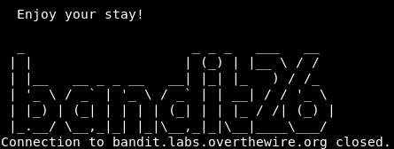
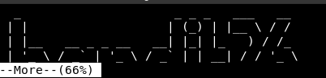

# Bandit

My WU of the Bandit wargame from overthewire. The Bandit wargame is aimed at absolute beginners. It will teach the basics needed to be able to play other wargames.


### Level 0


The goal of this level is for you to log into the game using SSH. The host to which you need to connect is `bandit.labs.overthewire.org`, on port `2220`. The username is bandit0 and the password is bandit0. Once logged in, go to the Level 1 page to find out how to beat Level 1.

```sh
ssh bandit0@bandit.labs.overthewire.org -p 2220
```

#### Solution

```sh
cat readme
```

**`boJ9jbbUNNfktd78OOpsqOltutMc3MY1`**


### Level 1


The password for the next level is stored in a file called `-` located in the home directory

```sh
ssh bandit1@bandit.labs.overthewire.org -p 2220
```

#### Solution


Using `-` as a filename to mean stdin/stdout is a convention that a lot of programs use. It is not a special property of the filename. The kernel does not recognise `-` as special so any system calls referring to `-` as a filename will use `-` literally as the filename.

With bash redirection, `-` is not recognised as a special filename, so bash will use that as the literal filename.

When cat sees the string `-` as a filename, it treats it as a synonym for stdin. To get around this, you need to alter the string that cat sees in such a way that it still refers to a file called `-`. The usual way of doing this is to prefix the filename with a path  `./-`, or `/home/username/-`. This technique is also used to get around similar issues where command line options clash with filenames, so a file referred to as `./-e` does not appear as the -e command line option to a program, for example.

```sh
cat /home/bandit1/-
```

**`CV1DtqXWVFXTvM2F0k09SHz0YwRINYA9`**


### Level 2

The password for the next level is stored in a file called `spaces in this filename` in this filename located in the home directory

```sh
ssh bandit2@bandit.labs.overthewire.org -p 2220
```

#### Solution

```sh
cat spaces\ in\ this\ filename
```

**`UmHadQclWmgdLOKQ3YNgjWxGoRMb5luK`**


### Level 3

The password for the next level is stored in a hidden file in the `inhere` directory.

```sh
ssh bandit3@bandit.labs.overthewire.org -p 2220
```

#### Solution

```sh
cat inhere/.hidden
```

**`pIwrPrtPN36QITSp3EQaw936yaFoFgAB`**


### Level 4

The password for the next level is stored in the only `human-readable` file in the `inhere` directory. Tip: if your terminal is messed up, try the `reset` command.

```sh
ssh bandit4@bandit.labs.overthewire.org -p 2220
```

#### Solution

```sh
file inhere/*

inhere/-file00: data
inhere/-file01: data
inhere/-file02: data
inhere/-file03: data
inhere/-file04: data
inhere/-file05: data
inhere/-file06: data
inhere/-file07: ASCII text
inhere/-file08: data
inhere/-file09: data

cat inhere/-file07
```

**`koReBOKuIDDepwhWk7jZC0RTdopnAYKh`**


### Level 5


The password for the next level is stored in a file somewhere under the `inhere` directory and has all of the following properties:

+ human-readable
+ 1033 bytes in size
+ not executable


```sh
ssh bandit5@bandit.labs.overthewire.org -p 2220
```

#### Solution

```sh
find . -readable -size 1033c ! -executable

./inhere/maybehere07/.file2


cat ./inhere/maybehere07/.file2
```

**`DXjZPULLxYr17uwoI01bNLQbtFemEgo7`**


### Level 6


The password for the next level is stored somewhere on the server and has all of the following properties:

+ owned by user bandit7
+ owned by group bandit6
+ 33 bytes in size


```sh
ssh bandit6@bandit.labs.overthewire.org -p 2220
```

#### Solution

```sh
find / -user bandit7 -group bandit6 -size 33c

# Lots of files for which you don't have read rights (except one)

cat /var/lib/dpkg/info/bandit7.password
```

**`HKBPTKQnIay4Fw76bEy8PVxKEDQRKTzs`**


### Level 7

The password for the next level is stored in the file `data.txt` next to the word `millionth`

```sh
ssh bandit7@bandit.labs.overthewire.org -p 2220
```

#### Solution

```sh
cat data.txt | grep millionth
```

**`cvX2JJa4CFALtqS87jk27qwqGhBM9plV`**


### Level 8

The password for the next level is stored in the file `data.txt` and is the only line of text that occurs only once

```sh
ssh bandit8@bandit.labs.overthewire.org -p 2220
```
#### Solution

```sh
sort data.txt | uniq --unique
```

**`UsvVyFSfZZWbi6wgC7dAFyFuR6jQQUhR`**

### Level 9

The password for the next level is stored in the file `data.txt` in one of the few human-readable strings, beginning with several `=` characters.

```sh
ssh bandit9@bandit.labs.overthewire.org -p 2220
```

#### Solution

```sh
strings data.txt | grep =
```

**`truKLdjsbJ5g7yyJ2X2R0o3a5HQJFuLk`**


### Level 10

The password for the next level is stored in the file `data.txt`, which contains base64 encoded data

```sh
ssh bandit10@bandit.labs.overthewire.org -p 2220
```

#### Solution

```sh
cat data.txt | base64 -d
```

**`IFukwKGsFW8MOq3IRFqrxE1hxTNEbUPR`**

### Level 11

The password for the next level is stored in the file `data.txt`, where all lowercase (a-z) and uppercase (A-Z) letters have been rotated by 13 positions

```sh
ssh bandit11@bandit.labs.overthewire.org -p 2220
```
#### Solution

```sh
cat data.txt | tr 'A-Za-z' 'N-ZA-Mn-za-m'
```

**`5Te8Y4drgCRfCx8ugdwuEX8KFC6k2EUu`**

### Level 12

The password for the next level is stored in the file `data.txt`, which is a hexdump of a file that has been repeatedly compressed. For this level it may be useful to create a directory under `/tmp` in which you can work using `mkdir`. For example: `mkdir /tmp/myname123`. Then copy the `datafile` using `cp`, and rename it using `mv` (read the manpages!)

```sh
ssh bandit12@bandit.labs.overthewire.org -p 2220
```

#### Solution

```sh
cd $(mktemp -d)

cp ~/data.txt .

# the base file is a hexdump. We can reverse the process.

xxd -r data.txt > bandit

# Then just check with the `file` command which file you currently have and use the commands accordingly.

# files compressed in `gzip` format can be extracted with `gunzip`. But you need the `gz` extension (so you should think about renaming `mv`).

gunzip [filename]

# compressed files in `bzip2` format can be decompressed with the following command:

bzip2 -d [filename] # -d => decompress

# tar archives

tar xvf [filename]
```

**`8ZjyCRiBWFYkneahHwxCv3wb2a1ORpYL`**


### Level 13

The password for the next level is stored in `/etc/bandit_pass/bandit14` and can only be read by user `bandit14`. For this level, you don’t get the next password, but you get a private SSH key that can be used to log into the next level. Note: localhost is a hostname that refers to the machine you are working on.

```sh
ssh bandit13@bandit.labs.overthewire.org -p 2220
```

#### Solution

we find the file `sshkey.private` so we can ssh into the localhost as user 'bandit14' and with the private key.

```sh
ssh -i sshkey.private bandit14@localhost

cat /etc/bandit_pass/bandit14
```
**`4wcYUJFw0k0XLShlDzztnTBHiqxU3b3e`**


### Level 14

The password for the next level can be retrieved by submitting the password of the current level to port 30000 on localhost.

```sh
ssh bandit14@bandit.labs.overthewire.org -p 2220
```

#### Solution

```sh
echo "4wcYUJFw0k0XLShlDzztnTBHiqxU3b3e" | nc localhost 30000
```

**`BfMYroe26WYalil77FoDi9qh59eK5xNr`**


### Level 15


The password for the next level can be retrieved by submitting the password of the current level to port 30001 on localhost using SSL encryption.

Helpful note: Getting `HEARTBEATING` and `Read R BLOCK`? Use -ign_eof and read the `CONNECTED COMMANDS` section in the manpage. Next to `R` and `Q`, the `B` command also works in this version of that command…

```sh
ssh bandit15@bandit.labs.overthewire.org -p 2220
```

#### Solution

```sh
echo "BfMYroe26WYalil77FoDi9qh59eK5xNr" | openssl s_client -ign_eof -connect localhost:30001
```

**`cluFn7wTiGryunymYOu4RcffSxQluehd`**


### Level 16

The credentials for the next level can be retrieved by submitting the password of the current level to a port on localhost in the range 31000 to 32000. First find out which of these ports have a server listening on them. Then find out which of those speak SSL and which don’t. There is only 1 server that will give the next credentials, the others will simply send back to you whatever you send to it.

```sh
ssh bandit16@bandit.labs.overthewire.org -p 2220
```

#### Solution

We look for open ports.

```sh
nmap -p- localhost

# We logs in to find the password.

openssl s_client -ign_eof -connect localhost:31790
```

You need to reset the password for the current challenge and you get an ssh key. Which we save as `bandit17.key`.


### Level 17

There are 2 files in the home directory: `passwords.old` and `passwords.new`. The password for the next level is in `passwords.new` and is the only line that has been changed between `passwords.old` and `passwords.new`

NOTE: if you have solved this level and see `Byebye!` when trying to log into bandit18, this is related to the next level, bandit19

```sh
ssh bandit17@bandit.labs.overthewire.org -p 2220 -i bandit17.key
```

#### Solution

```sh
diff passwords.old passwords.new
```

**`kfBf3eYk5BPBRzwjqutbbfE887SVc5Yd`**


### Level 18

The password for the next level is stored in a file readme in the home directory. Unfortunately, someone has modified `.bashrc` to log you out when you log in with SSH.

```sh
ssh bandit18@bandit.labs.overthewire.org -p 2220 "cat readme"
```

#### Solution

The password is retrieved directly with the login command.

**`IueksS7Ubh8G3DCwVzrTd8rAVOwq3M5x`**


### Level 19

To gain access to the next level, you should use the `setuid` binary in the home directory. Execute it without arguments to find out how to use it. The password for this level can be found in the usual place `/etc/bandit_pass`, after you have used the `setuid` binary.

```sh
ssh bandit19@bandit.labs.overthewire.org -p 2220
```

#### Solution

We have a file to run and we pass it a command to retrieve the password of bandit20.

```sh
./bandit20-do cat /etc/bandit_pass/bandit20
```

**`GbKksEFF4yrVs6il55v6gwY5aVje5f0j`**


### Level 20

There is a `setuid` binary in the home directory that does the following: it makes a connection to localhost on the port you specify as a command line argument. It then reads a line of text from the connection and compares it to the password in the previous level (bandit20). If the password is correct, it will transmit the password for the next level (bandit21).

```sh
ssh bandit20@bandit.labs.overthewire.org -p 2220
```

#### Solution

You need to open a listening port in TCP.

```sh
echo "GbKksEFF4yrVs6il55v6gwY5aVje5f0j" | nc -l localhost -p 61254 &

./suconnect 61254


# Read: GbKksEFF4yrVs6il55v6gwY5aVje5f0j
# Password matches, sending next password
```

**`gE269g2h3mw3pwgrj0Ha9Uoqen1c9DGr`**


### Level 21

A program is running automatically at regular intervals from `cron`, the time-based job scheduler. Look in `/etc/cron.d/` for the configuration and see what command is being executed.

```sh
ssh bandit21@bandit.labs.overthewire.org -p 2220
```

#### Solution

```sh
ls /etc/cron.d

# atop  cronjob_bandit22  cronjob_bandit23  cronjob_bandit24

cat cronjob_bandit22

#    @reboot bandit22 /usr/bin/cronjob_bandit22.sh &> /dev/null
#    * * * * * bandit22 /usr/bin/cronjob_bandit22.sh &> /dev/null


cat /usr/bin/cronjob_bandit22.sh

#   #!/bin/bash
#   chmod 644 /tmp/t7O6lds9S0RqQh9aMcz6ShpAoZKF7fgv
#   cat /etc/bandit_pass/bandit22 > /tmp/t7O6lds9S0RqQh9aMcz6ShpAoZKF7fgv

cat /tmp/t7O6lds9S0RqQh9aMcz6ShpAoZKF7fgv
```

**`Yk7owGAcWjwMVRwrTesJEwB7WVOiILLI`**


### Level 22

A program is running automatically at regular intervals from cron, the time-based job scheduler. Look in `/etc/cron.d/` for the configuration and see what command is being executed.

NOTE: Looking at shell scripts written by other people is a very useful skill. The script for this level is intentionally made easy to read. If you are having problems understanding what it does, try executing it to see the debug information it prints.

```sh
ssh bandit22@bandit.labs.overthewire.org -p 2220
```

#### Solution

```sh
cat /etc/cron.d/cronjob_bandit23

#    @reboot bandit23 /usr/bin/cronjob_bandit23.sh  &> /dev/null
#    * * * * * bandit23 /usr/bin/cronjob_bandit23.sh  &> /dev/null

cat /usr/bin/cronjob_bandit23.sh

#    #!/bin/bash
#    myname=$(whoami)
#    mytarget=$(echo I am user $myname | md5sum | cut -d ' ' -f 1)

#    echo "Copying passwordfile /etc/bandit_pass/$myname to /tmp/$mytarget"

#    cat /etc/bandit_pass/$myname > /tmp/$mytarget

$(echo I am user bandit23 | md5sum | cut -d ' ' -f 1)

# -bash: 8ca319486bfbbc3663ea0fbe81326349: command not found

cat /tmp/8ca319486bfbbc3663ea0fbe81326349
```

**`jc1udXuA1tiHqjIsL8yaapX5XIAI6i0n`**

### Level 23

A program is running automatically at regular intervals from cron, the time-based job scheduler. Look in `/etc/cron.d/` for the configuration and see what command is being executed.

NOTE: This level requires you to create your own first shell-script. This is a very big step and you should be proud of yourself when you beat this level!

NOTE 2: Keep in mind that your shell script is removed once executed, so you may want to keep a copy around…

```sh
ssh bandit23@bandit.labs.overthewire.org -p 2220
```

#### Solution

```sh
cd $(mktemp -d)

# /tmp/tmp.vqqZkF0eeo

touch test.sh
touch pass
chmod 777 test.sh
chmod 666 pass

vi test.sh

#    #!/bin/bash
#    cat /etc/bandit_pass_bandit24 > /tmp/tmp.vqqZkF0eeo/pass

# (Wait a minute)

cat password
```

**`UoMYTrfrBFHyQXmg6gzctqAwOmw1IohZ`**


### Level 24

A daemon is listening on port 30002 and will give you the password for bandit25 if given the password for bandit24 and a secret numeric 4-digit pincode. There is no way to retrieve the pincode except by going through all of the 10000 combinations, called brute-forcing.

```sh
ssh bandit24@bandit.labs.overthewire.org -p 2220
```

#### Solution

```sh
cd $(mktemp -d)
```

```python
import socket
s = socket.socket(socket.AF_INET, socket.SOCK_STREAM)
s.connect(("localhost", 30002))
s.recv(1024)
for i in range(1000):
    print('UoMYTrfrBFHyQXmg6gzctqAwOmw1IohZ {0:04}'.format(i))
    data = "UoMYTrfrBFHyQXmg6gzctqAwOmw1IohZ {0:04}".format(i)+"\n"
    s.sendall(data.encode())
    response = s.recv(1024).decode()
    print(response)
    if("Wrong" in response):
        print('ok')
    else:
        print("Got it ", i)
        break
s.close()
```

**`uNG9O58gUE7snukf3bvZ0rxhtnjzSGzG`**


### Level 25

Logging in to bandit26 from bandit25 should be fairly easy... The shell for user bandit26 is not `/bin/bash`, but something else. Find out what it is, how it works and how to break out of it.

```sh
ssh bandit25@bandit.labs.overthewire.org -p 2220
```

#### Solution

We connect to bandit 25 and get the ssh key from bandit 26.
We can connect to bandit 26.
But first we look at the following file through bandit 25

```sh
cat /etc/passwd

# bandit26:x:11026:11026:bandit level 26:/home/bandit26:/usr/bin/showtext
```

We look into `/usr/bin/showtext`
```
#!/bin/sh
export TERM=linux
more ~/text.txt
exit 0
```

We are in the `sh` shell and the more command is executed from the start to see the `~/text.txt` file.

We now connect to bandit 26.

```sh
ssh bandit26@bandit.labs.overthewire.org -p 2220 -i bandit26.sshkey
```

At the connection, we see:




We do the same thing again but reduce the size of our terminal so that the `more` command is effective.




To enter edit mode in `more`, you type `v`.
This uses `vi`. Enter the command
```sh
:e /etc/bandit_pass/bandit26
```

**`5czgV9L3Xx8JPOyRbXh6lQbmIOWvPT6Z`**


### Level 26

Good job getting a shell! Now hurry and grab the password for bandit27!

```sh
ssh bandit26@bandit.labs.overthewire.org -p 2220
```

#### Solution

As before, we connect to bandit 26 with a small terminal. Switch to `v` edit mode. Enter the command.

```sh
:set shell=/bin/bash

:shell

# We finally get a shell in `vi` which allows us to run any command we want.

cat /etc/bandit_pass/bandit27
```

**`3ba3118a22e93127a4ed485be72ef5ea`**


### Level 27

There is a git repository at `ssh://bandit27-git@localhost/home/bandit27-git/repo`. The password for the user bandit27-git is the same as for the user bandit27.

Clone the repository and find the password for the next level.

```sh
ssh bandit27@bandit.labs.overthewire.org -p 2220
```

#### Solution

```sh
cd $(mktemp -d)
git clone ssh://bandit27-git@localhost/home/bandit27-git/repo
cat README
```

**`0ef186ac70e04ea33b4c1853d2526fa2`**


### Level 28


There is a git repository at `ssh://bandit28-git@localhost/home/bandit28-git/repo`. The password for the user bandit28-git is the same as for the user bandit28.

Clone the repository and find the password for the next level.

```sh
ssh bandit28@bandit.labs.overthewire.org -p 2220
```

#### Solution

```sh
cd $(mktemp -d)
git clone ssh://bandit28-git@localhost/home/bandit28-git/repo
git log

#    commit 073c27c130e6ee407e12faad1dd3848a110c4f95
#    Author: Morla Porla <morla@overthewire.org>
#    Date:   Tue Oct 16 14:00:39 2018 +0200

#        fix info leak

#    commit 186a1038cc54d1358d42d468cdc8e3cc28a93fcb
#    Author: Morla Porla <morla@overthewire.org>
#    Date:   Tue Oct 16 14:00:39 2018 +0200

#        add missing data

#    commit b67405defc6ef44210c53345fc953e6a21338cc7
#    Author: Ben Dover <noone@overthewire.org>
#    Date:   Tue Oct 16 14:00:39 2018 +0200

#        initial commit of README.md

git checkout 186a1038cc54d1358d42d468cdc8e3cc28a93fcb
cat README
```

**`bbc96594b4e001778eee9975372716b2`**


### Level 29

There is a git repository at `ssh://bandit29-git@localhost/home/bandit29-git/repo`. The password for the user bandit29-git is the same as for the user bandit29.

Clone the repository and find the password for the next level.


```sh
ssh bandit29@bandit.labs.overthewire.org -p 2220
```

#### Solution

We look into `README.md`

```sh
cat README.md

#    # Bandit Notes
#    Some notes for bandit30 of bandit.

#    ## credentials

#    - username: bandit30
#    - password: <no passwords in production!>

# So we look at whether there are other branches

git branch -r

#    origin/HEAD -> origin/master
#    origin/dev
#    origin/master
#    origin/sploits-dev

# We change branch and find the password in the README.md

git checkout dev
```

**`5b90576bedb2cc04c86a9e924ce42faf`**


### Level 30

There is a git repository at `ssh://bandit30-git@localhost/home/bandit30-git/repo`. The password for the user bandit30-git is the same as for the user bandit30.

Clone the repository and find the password for the next level.

```sh
ssh bandit30@bandit.labs.overthewire.org -p 2220
```

#### Solution

```sh
git tag

# secret

git show secret
```

**`47e603bb428404d265f59c42920d81e5`**

### Level 31

There is a git repository at `ssh://bandit31-git@localhost/home/bandit31-git/repo`. The password for the user bandit31-git is the same as for the user bandit31.

Clone the repository and find the password for the next level.

```sh
ssh bandit31@bandit.labs.overthewire.org -p 2220
```

#### Solution

```sh
cd $(mktemp -d)
git clone ssh://bandit31-git@localhost/home/bandit31-git/repo
cat README.md

#    This time your task is to push a file to the remote repository.

#    Details:
#        File name: key.txt
#        Content: 'May I come in?'
#        Branch: master

git add -f key.txt
git commit -m "bandit31"
git push
```

**`56a9bf19c63d650ce78e6ec0354ee45e`**

### Level 32

After all this git stuff its time for another escape. Good luck!

```sh
ssh bandit32@bandit.labs.overthewire.org -p 2220
```

#### Solution

Once logged in, a shell in upper case opens

Remember that
+ $0 => the name of the called script (with full path)
+ $# => number of arguments
+ $@ => list of arguments.

```sh
$0

# The bash that ran the "Shift" script is recalled

cat /etc/bandit_pass/bandit33
```

**`c9c3199ddf4121b10cf581a98d51caee`**

### Level 33

At this moment, level 34 does not exist yet.

```sh
ssh bandit33@bandit.labs.overthewire.org -p 2220
```

#### Solution

```sh
cat README.txt

#    Congratulations on solving the last level of this game!

#    At this moment, there are no more levels to play in this game. However, we are constantly working
#    on new levels and will most likely expand this game with more levels soon.
#    Keep an eye out for an announcement on our usual communication channels!
#    In the meantime, you could play some of our other wargames.

#    If you have an idea for an awesome new level, please let us know!
```

THE END
