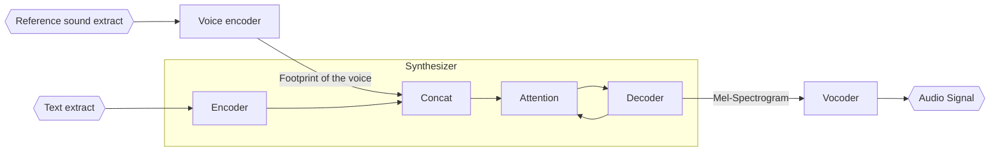

# Deepfake audio

1. Creation of a "footprint" of the person's voice using the encoder
2. Adding this footprint to the synthesizer which translates any text into a mel-spectrogram. The synthesizer produces the general mechanisms of speech and with the addition of the footprint, we can say that the spectrogram also contains the nuances of the person's voice.
3. The mel-spectrogram is interpreted by the vocoder which translates it into an audio signal that we can listen to.

Source: [Transfer Learning from Speaker Verification to
Multispeaker Text-To-Speech Synthesis](https://arxiv.org/pdf/1806.04558.pdf)