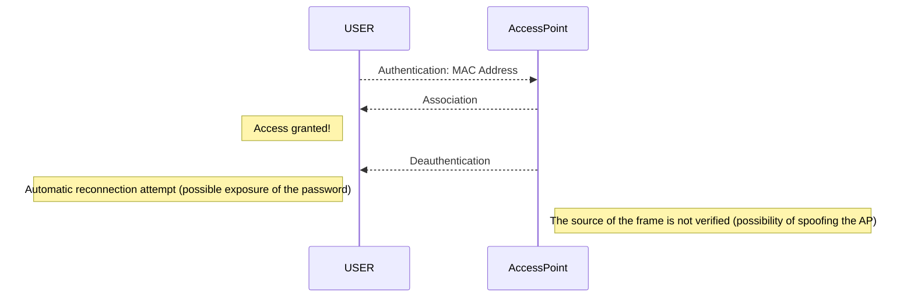

# DOS - DDOS

## Denial of service

Concept: Filling a storage area or communication channel until it can no longer be used.

### DoS by smurf

* The attacking machine sends a ping to broadcast servers with a modified source IP address (the one of the target)
* The server echoes the request throughout the network
* All machines respond to the target IP server
* The target receives a lot amount of requests to proceed.

### DoS by SYN flood

* The attacker sends a high volume of SYN packets to the targeted server, often with spoofed IP addresses.
* The server then responds to each connection request and leaves a port open to receive the response.
* While the server waits for the last ACK packet, which never arrives, the attacker continues to send more SYN packets. The arrival of each new SYN packet forces the server to temporarily keep a new port connection open for a while, and once all available ports have been used, the server can no longer function normally.


### Example

**Scapy**

```python
i = IP()
i.dst = "192.168.133.255"

ping = ICMP()
request = (i/ping)
send(request) # run wireshark

# in 1 line

send(IP(dst="192.168.133.255", src="192.168.133.129")/ICMP(), count=1000, verbose=1)
```

The goal is to make specific services unavailable by generating as many requests as possible to the service to be saturated.

An attack originating from a single IP address will be limited and easier to block.

## DDOS attack (Distributed Denial of Service)

The multiplication of the origins of the requests allows

- to obtain a virtually unlimited bandwidth
- to make it almost impossible to block by IP


### Reflection attack

* Contacting a large number of machines by providing them with an erroneous source address.
* This address will be replaced by the address of the server to be saturated so that the responses of the machines contacted reach it directly.
* If the number of responses is high enough and/or if the messages received involve significant processing, the target and/or the network will be saturated and their proper functioning compromised.

Nota Bene:
> * UDP has priority over TCP and does not implement a congestion control mechanism.
> * UDP works without session => possibility to modify the source address.


### Amplification attack

The operation is the same as for the reflection attack but using a protocol with the particularity of sending responses with very large packets (to generate a large traffic).

The protocols used:

- **Network Time Protocol (NTP)**: sends a request to synchronize the machines on the network. The answers are of higher size.
- **HTTP**: by requesting resources from the server regularly, we keep an active connection with it. If many malicious machines make periodic requests, the maximum number of connections to the server can be reached and will be unreachable.
- **SNMP**: simple version: **Ping of Death**, send a ping with a size larger than the default. This was fixed in 1998 but improved by using amplification. Sending an ICMP REQUEST packet in broadcast. The number of packets increases proportionally to the number of machines in the network.

## DOS WIFI





```bash
aireplay-ng <interface-name> --deauth=3 -a xx:xx:xx:xx:xx:xx # default, destination == broadcast (ff:ff:ff:ff:ff:ff)
# a = bssid
# deauth = frames
```

