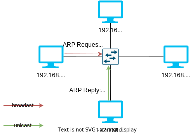

# Man in the Middle

**Concept:**
The hacker is connected to the same switch as the victims and performs a kind of relay between them.

## ARP protocol

Computer-1 wants to communicate with Computer-2 and sends an ARP request to get its MAC address. Computer-2 returns its MAC address.




## Tools

### 3vilTwinAtatcker
Create a fake access point to facilitate an MITM attack.

## MITM Proxy

[mitmproxy](https://mitmproxy.org/) allows to:

* examine multiple client-side requests
* examine HTTPS traffic, replay requests...
* alter web server requests or responses


```bash
mitmproxy # 'i' to 'insert'
? # help
```
