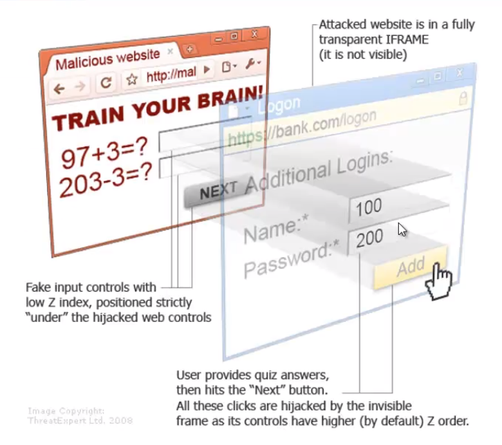

# Click & Cursor Jacking

Clickjacking: a malicious way to trick a user into providing confidential information or taking control of their computer by tricking them into clicking on apparently safe pages.

# Cursor jacking

Aims to create an offset between where you appear to click and where you actually click. This allows you to click anywhere.

Example of cursor jacking code: [cursor jacking example](http://blog.kotowicz.net/2012/01/cursorjacking-again.html)