# Example of a complete analysis

## Static analysis

### Loading the file into PEID

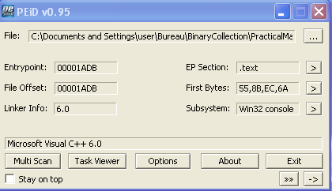

### List of sections

Here we can see that there are resources inside the binary.

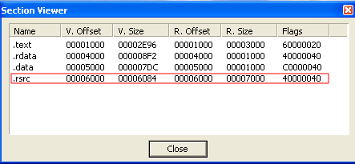

### Strings in the binary

The `svchost.exe` string in a binary is not usual.

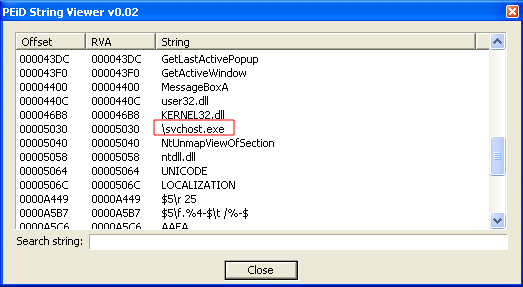

### Extracting resources

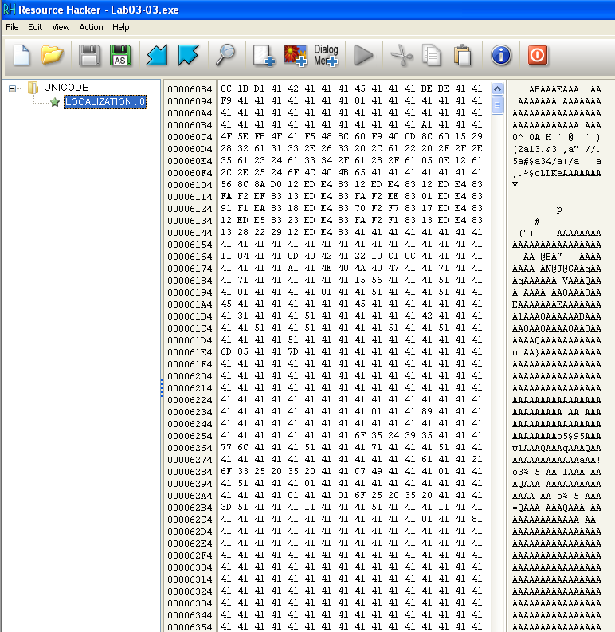

Note that the extracted resource contains a lot of `0x41`. Perhaps a xor is performed to hide the resources.

### DependencyWalker Imports

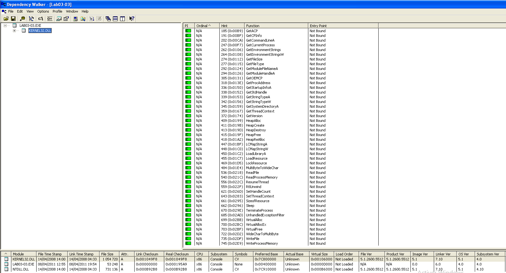

## Dynamic analysis

### Procmon in capture

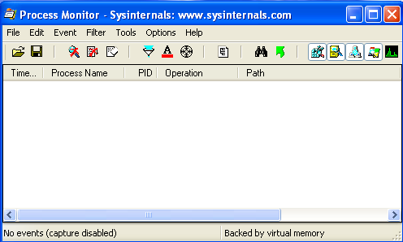

### Regshot 1/2

Before launching the binary, you need to do a first shot with RegShot to get a fingerprint of the Windows registry and see which ones have been modified.

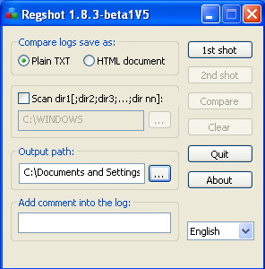

### Regshot 2/2

Here we have all registry that have been modified or added during the process execution.

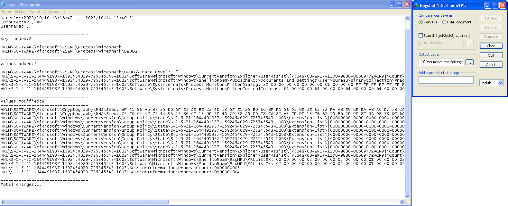

### Process explorer

On the process explorer capture, we can see that after we started the malware, a new process called `svchost.exe` was also started.

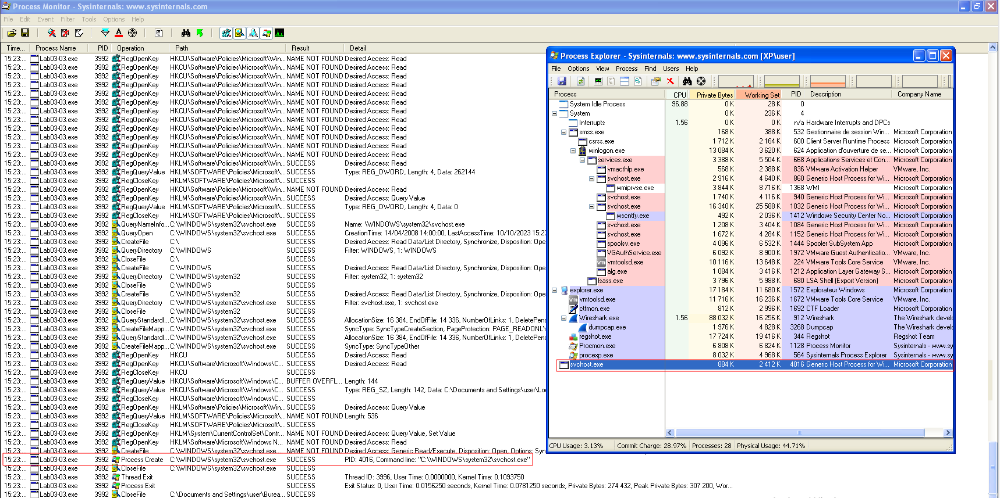

### Comparing strings

When comparing strings present in the binary and strings present in memory, we can see that they are not the same.

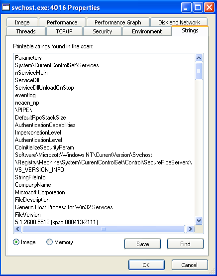

Strings in memory look like keyboard keys. There is also a log file name. Could it be a keylogger?

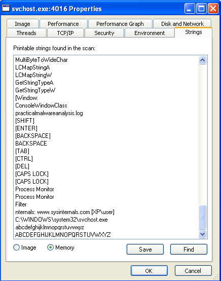

### Execution

During the execution, we can see that the `svchost.exe` process is created and that nothing is going through the network (the wireshark window stays empty).

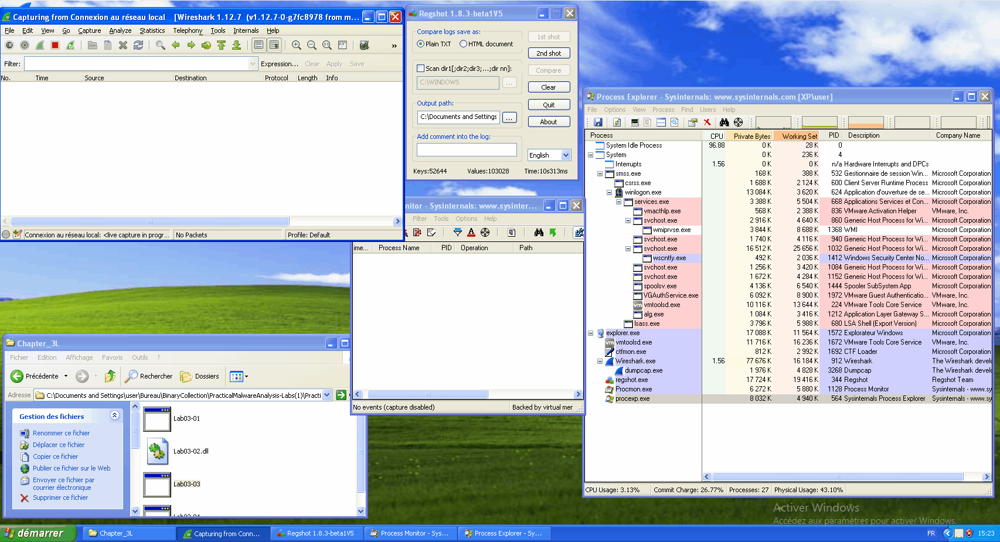

While our **infected** `svchost.exe` continues to run, let's relaunch **procmon** and filter on the **infected** PID. And let's write to a notepad. We can see some operations such as `CreateFile`, `WriteFile`, `CloseFile`...

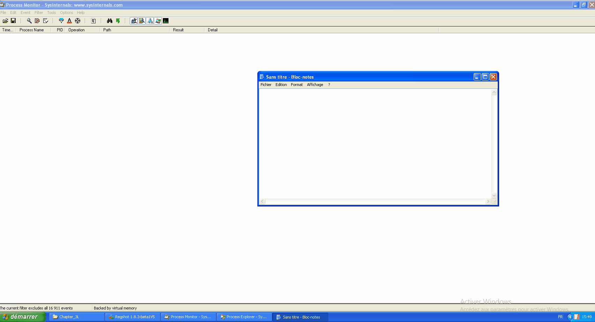

You can find the path where the registered keyboard keys are located.

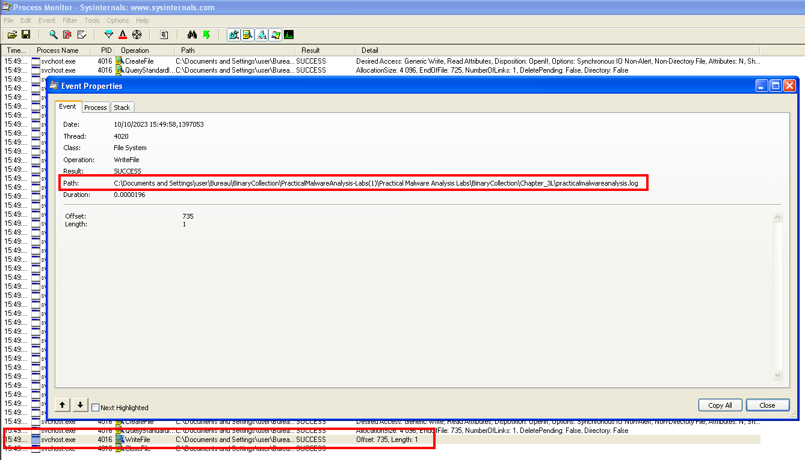

Content of the created log file.

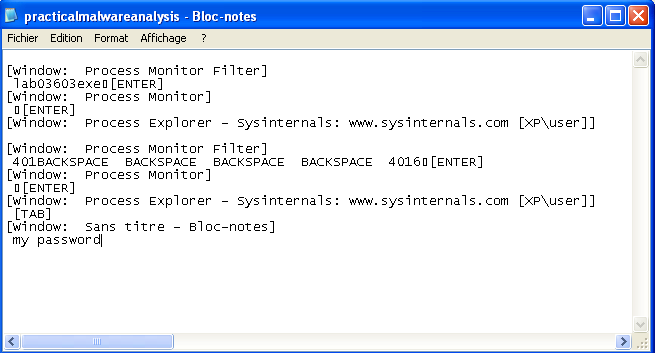
