# Reverse Engineering

## Static analysis

### How to know if a binary is packed

- *PEid*
  - Raw Size and Virtual Size are very different
  - Character strings are random.
  - Non-standard section names (UPX0, ...)
- *Dependency viewer*
  - Low number of imports

### Extract resource section from a binary

- *Resource Hacker*
  - if a binary contains resources (section **.rsrc**), it's possible to view/extract it with this software).

### UPX

*UPX*, is a tool called packer, used to pack/unpack a binary.


## Dynamic analysis

- *procmon* - monitor the actions performed on the system when malware is launched
- *process explorer* - obtain information on the process in memory (there may be differences between the binary on disk and what runs in memory - (strings present, DLLs loaded, etc.))
- *inetsim* - simulate network responses to allow malware to continue executing normally (if in multiple VMs, change `DNS IP` and `bind_address` to listen on all interfaces, not just local)
- *wireshark* - capture network traffic
- *regshot* - capture windows registry before and after malware execution


If you need to analyze a DLL, you can execute with **cmd.exe** using the following command:

```cmd
rundll32.exe <dll_path>, <exported_func>
```


<div class="warning">
    Malware may want to delete itself. This can fail if other software has a <b>handle</b> on it. For example, during static analysis, a <b>handle</b> can be kept on the malware and removal fails.
</div>


## A few tips on using IDA

- to identify a local variable for a function, IDA specifies negative addresses (relative to **esp**) - otherwise it's an argument.

  


### Some shortcuts

- Rename what you understand, variables, functions... (keyboard shortcut: **`n`**)

- Add comments (keyboard shortcut: **`:`**)

- jump to a specific line (keyboard shortcut: **`g`**)

- display *cross*-references (X-ref) (keyboard shortcut: **`x`**)


### How to read

```assembly
mov dest, src
xor edx, edx ; sets edx to 0
```

#### Arguments are pushed on the stack, from right to left.

From the windows documentation [socket windows documentation](https://learn.microsoft.com/en-us/windows/win32/api/winsock2/nf-winsock2-socket)

```c++
SOCKET WSAAPI socket(
  [in] int af,
  [in] int type,
  [in] int protocol
);
```

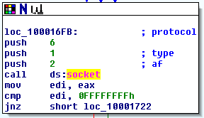

In this `socket` call, `protocol=6`, `type=1` and `af=2`.


## Quick binary analysis

In the **functions** tab, we search for the **_main** function, which is the entry point for our program.

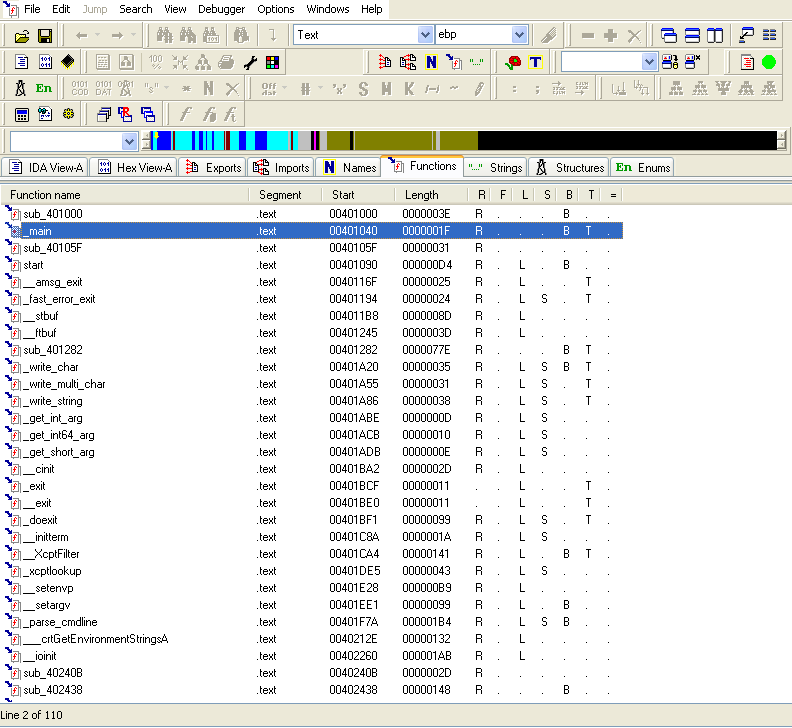

We finally realize that our binary contains a simple `if` displaying whether it has access to the Internet or not.

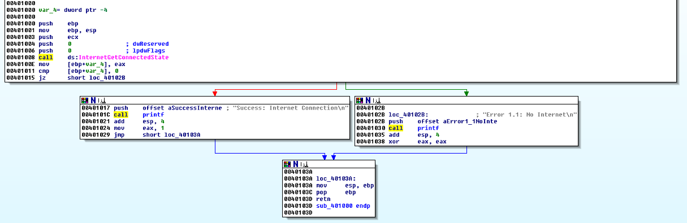

> The `printf` function is not recognized by IDA, but you can tell it's this function by a quick scan. A call to `_stbuf` and `_ftbuf` is made.
>
> 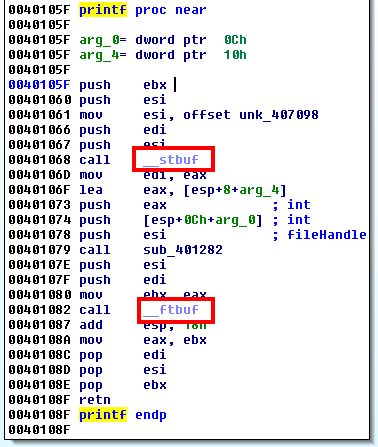


The `InternetReadFile` function takes a buffer and buffer size as parameters. Here, we push 512 bytes (200h). Except that at declaration time, we notice that the `Buffer` variable (IDA didn't notice it was an array, so it just says it's a pointer) isn't 512 bytes (difference between `Buffer` and `var_20c`).

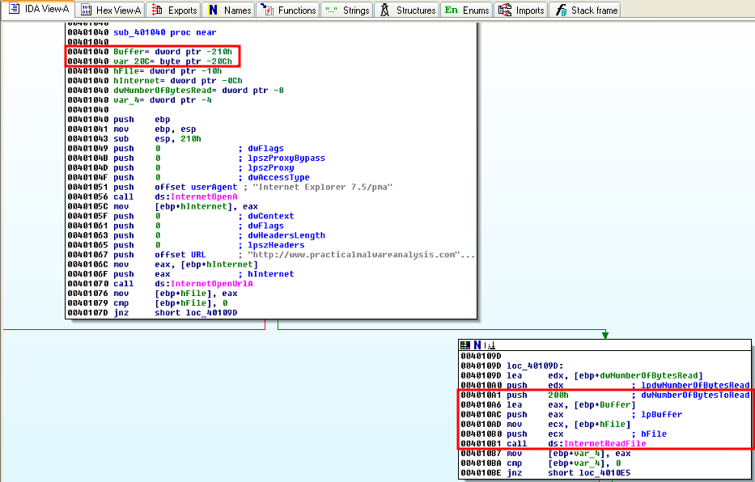


To modify this interpretation of IDA, move to the Buffer declaration, then `ctrl+k`.

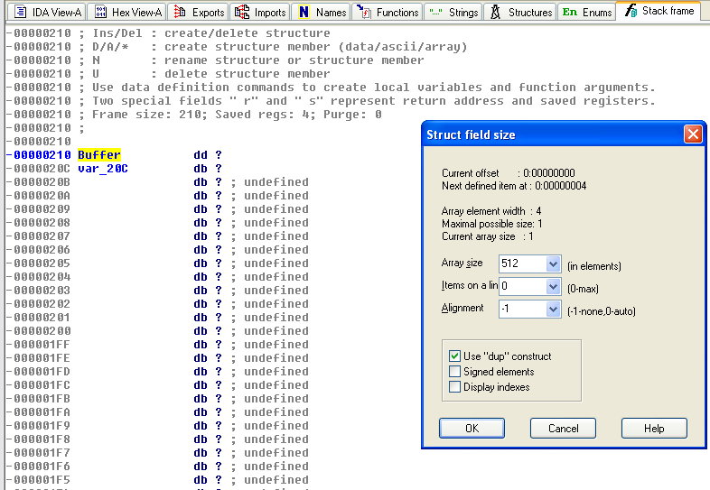

After modification:

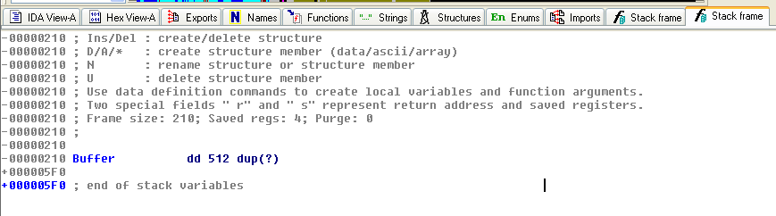


After the `InternetReadFile` function, the program checks the beginning of the response and look for a specific command so that it knows what to do next.

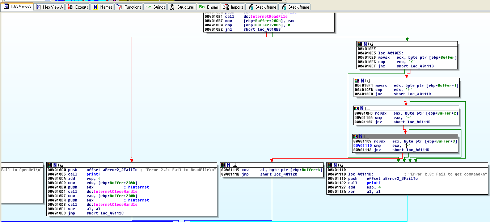

Valid commands are `[a, b, c, d, e]`

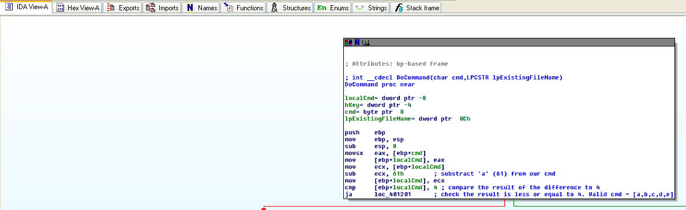

### Dynamically testing commands

Appending a comment in the inetsim fake html page. (The **a** command should create a directory)

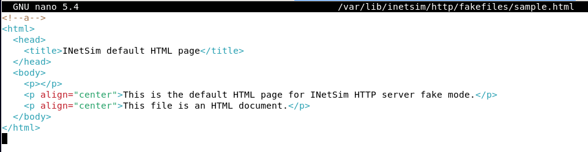

Executing the malware

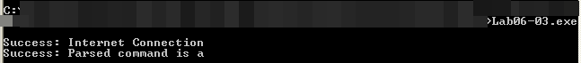

The new Temp directory is then created

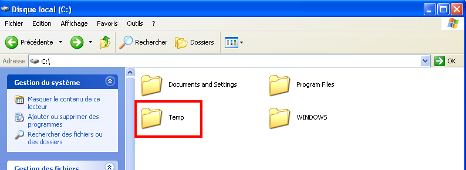


